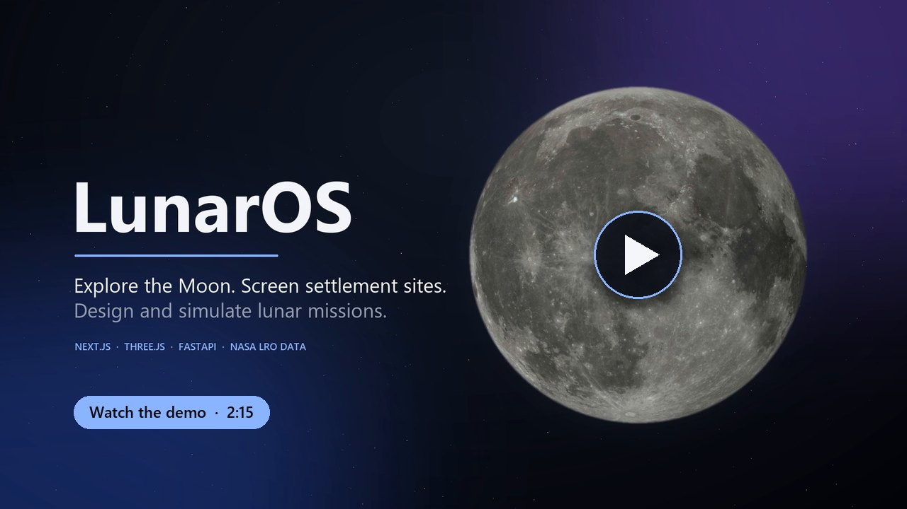

# LunarOS

Explore the Moon, screen candidate sites, build hypothetical infrastructure and
simulate its power system on one 3D lunar canvas. **Explore / Build / Simulate**
share the header; everything else is contextual and closes back to the Moon.

[](https://lucas-ligenza-portfolio.vercel.app/media/lunaros-demo.mp4)

*2-minute walkthrough recorded against the running app: globe and overlays,
point inspection, settlement screening, mission building and simulation playback.*

**Surfaces.** One canvas, one menu at top-left and one drawer at right:

- **Overlays ▾** chooses what is drawn: Imagery, Elevation, Slope, Solar
  visibility, Temperature or Geology, with opacity, legend and coverage.
  Terrain source, comparison and display toggles sit under *Source details*.
- **Location** opens when you click the Moon. It aggregates every prepared value
  at the point: elevation, slope and native resolution; modeled average solar
  visibility and Diviner brightness temperature where the polar crop covers it;
  the USGS geological unit; data coverage; nearby mission assets. Unavailable
  data reads *Unavailable here*, *Missing source data* or *Not prepared*.
  Technical sampling and sources are disclosed below the overview.
- **Settlement sites** (from Location) ranks nearby neighborhoods with a
  *preliminary screening score* and draws the selected candidate's actual native
  analysis cells on the Moon. See [screening](docs/settlement-screening.md).
- **Missions**, **Add asset**, the **Asset** inspector and **Simulation setup**
  are separate surfaces in Build/Simulate. Analysis tools (regional statistics,
  profiles, sectors, dataset catalog) open from Location or the command palette
  (**Ctrl/Cmd K**). On phones each surface is a bottom sheet over the Moon.

**Preliminary screening score** = 100 × low-slope area fraction, using native
terrain, the only screening criterion prepared for the entire Moon. Average solar
visibility and temperature exist only for the prepared south-pole crop, so they
are shown as descriptive evidence and never scored. It is a relative
engineering-screening aid, never habitability, safety or mission success.

**Simulation.** Simulate shows the compact playback bar, a power-flow card that
explains each interval from the stored Python result (generation, demand,
battery charge/discharge, curtailment, shortage, status NOMINAL / POWER LIMITED /
BATTERY RESERVE / POWER SHORTAGE), event marks on the timeline, asset state cues
on the Moon and a mission outcome in *View details*. *How it works* opens a
six-step tutorial. Illumination inputs remain explicitly hypothetical. Rovers can
follow a deterministic great-circle route (rover-kinematics-1); scrubbing or
reopening a run reproduces positions exactly, and motion does not change power
demand. See the [energy model](docs/energy-model.md) and
[interaction redesign](docs/interaction-redesign.md).

Explore the entire Moon in 3D with NASA imagery and coarse LOLA relief, then move
into validated south-pole terrain analysis and hypothetical infrastructure simulation.
See [PROGRESS.md](PROGRESS.md) for completed milestones and remaining work.
See the [Phase 3 plan](docs/phase3-plan.md), [global data](docs/global-data.md),
[Phase 2 acceptance evidence](docs/phase2-acceptance.md) and [mission API](docs/mission-api.md).

Requires Python 3.12+, [uv](https://docs.astral.sh/uv/getting-started/installation/),
and Node.js 24 with npm. Dependencies are locked for reproducible installation.
Run from the repository root:

```powershell
uv sync --locked
uv run python -m backend.app.data.pipeline
uv run python -m backend.app.data.globe
uv run python -m backend.app.data.atlas
uv run pytest
```

The active pipeline downloads about 80 MB, validates pinned hashes and polar CRS,
and prepares a 96 x 96 km region at 240 m resolution. Use `--offline` to reprocess
cached files. See [data setup](data/README.md). Downloads and GeoTIFFs are ignored.
No synthetic data is substituted if acquisition fails.
The global pipeline additionally prepares compact NASA visualization textures and
the native 0.25 degree LOLA overview. See [global data](docs/global-data.md) for
source integrity, coverage and the distinction between visualization and analysis.
The atlas additionally obtains the pinned 133 MB GLD100 global 32 ppd product,
preserving native values and PDS special codes. `--plan` reports acquisition/disk
requirements, and `--offline` reuses verified source files. **Overlays → Source
details** chooses among registered global terrain sources; **Open dataset
catalog** (Ctrl/Cmd K) searches the scientific catalog. Discovered products are
labeled separately from prepared numerical sources. See [Phase 4 plan](docs/phase4-plan.md).
The catalog previews acquisition/disk budgets and browses verified PDS
collection metadata. Discovery preserves labels, coverage fields, file sizes,
periods and source checksums; it downloads no numeric product and does not enable
unvalidated thermal queries. See [data discovery](docs/dataset-discovery.md).

Install the frontend from the repository root:

```powershell
cd frontend
npm ci
```

Start the backend in a terminal at the repository root:

```powershell
uv run uvicorn backend.app.main:app --host 127.0.0.1 --port 8000
```

Start the frontend in a second terminal:

```powershell
cd frontend
npm run dev
```

Open **http://127.0.0.1:3000** for **Explore**. Drag to orbit, right-drag or
use arrow keys to pan, scroll to zoom, and click the Moon to select a location.
Focus the globe and press Enter to select the center of the view. **Places**
searches seven destinations and *Go to coordinates*; imagery and graticule toggles
sit under Overlays → Source details. The Location drawer lists every prepared value
and its coverage; its footer offers **Find settlement sites**, **Create mission
here** and **Analyze this region**.
Inside the prepared polar footprint, analysis retains the 240 m map. Elsewhere,
regional analysis uses native global atlas data and the 3D surface. Global missions
validate asset placement against GLD100 (or prepared LOLA if GLD100 is absent).
These coarser samples cannot establish landing or construction safety. Global
source frames retain their precision qualifications; no surveyed transform is implied.
The top mode controls preserve location, camera, active scenario, drafts and the
selected simulation interval. Hidden playback pauses. On phones each surface is a
bottom sheet over the Moon, one at a time.

In 2D polar analysis, drag or scroll the map, choose elevation/slope/solar
visibility in Overlays, and click a location to inspect it. The Location drawer's
*Go to coordinates* accepts planetocentric latitude and east-positive longitude.
Units, methods, sampling footprints and sources are disclosed in that drawer. At latitude
`-89.5`, longitude `0`, the prepared raster reports -705 m elevation.

In **Build**, select terrain, open **Missions → New mission at selected site**
(or **Create mission here**), name it and choose **Create scenario at selected site**.
Use **Add asset**, then click valid terrain to place the selected equipment.
Click its icon or its entry in Missions to configure it. **Save asset** persists
parameters; **Move on map** relocates it. A rover's **Set destination on map**
adds a hypothetical route (speed, departure, dwell, return). **Missions** reopens,
renames, duplicates or deletes scenarios; deletion requires confirmation.
Placements save immediately through the API; unsaved form changes are labeled.
Reopening restores the saved definition after confirming any discarded drafts.
Simultaneous edits return a revision conflict; reopen before retrying your changes.
On small screens, contextual panels become task sheets with clear Close actions.
The local database is `data/local/missions.sqlite`, separate from downloaded rasters.
Set `LUNAROS_DB_PATH` before backend startup to use another database path.

To exercise energy simulation, place a habitat, solar array and battery. In
**Simulate**, open **Set up simulation**, set the UTC period/time step and choose **Fill constant
profile**, **Apply synthetic stress profile**, or enter one electrical input factor
per interval. These are explicitly hypothetical inputs; NASA average visibility
cannot reconstruct sunlight over time. **Run simulation** saves changed inputs
and executes the Python engine. It never generates a lunar daily cycle.

The bottom timeline shows computed generation, demand, battery SOC and event
marks. Scrub, play/pause, change speed, narrow the chart window, or jump to an
event. The power-flow card and asset badges follow that interval. Powers are interval
averages and SOC is the interval-end value. Saving any scenario edit clears stale
telemetry; rerun to update it. Reopening an unchanged scenario restores its saved
result. See the [energy model](docs/energy-model.md) for equations and omissions.
Mission timestamps use whole-second UTC precision. Empty or non-finite entries
in an input series are rejected rather than interpolated or treated as zero.

The frontend proxies `/api` to the backend at `http://127.0.0.1:8000`. Set
`LUNAROS_BACKEND_URL` before starting Next.js if the backend runs elsewhere.
Visit http://127.0.0.1:8000/docs for interactive API documentation, or read
[API documentation](docs/API.md). If data preparation fails, fix the reported
download/validation error; the app displays an unavailable state without fake data.

Validate from the repository root with `uv run pytest`. Frontend checks run from
`frontend`:

```powershell
npm run typecheck
npm run build
npx playwright install chromium
npm test
```

Browser tests use the actual prepared NASA data and start both local servers when
needed. On Linux, use `npx playwright install --with-deps chromium` to install
browser system dependencies. `npm run build` followed by `npm start` also serves
the frontend locally; this project has not been deployed to a public service.
GitHub Actions repeats these checks and downloads the pinned data on a fresh Linux
runner. See [Phase 1](docs/phase1-acceptance.md) and
[Phase 2](docs/phase2-acceptance.md) and [Phase 3](docs/phase3-acceptance.md)
acceptance evidence for test coverage and rendered visual review.
The [Phase 4 acceptance record](docs/phase4-acceptance.md) describes global atlas
coverage, additional geology, browser review and measured performance limits.

The 240 m terrain grid supports regional exploration, not landing-hazard analysis.
The global 0.25° elevation source is approximately 7.58 km per pixel at the equator;
its display mesh uses 1° spacing and the visualization texture reaches 4096 × 2048.
Scientific coloring loads progressively from native 32 ppd GLD100 cells, about
948 m equatorial spacing; geometry remains coarse. Global visual selection
is suitable for navigation; construction-scale conclusions need finer verified data.
Solar visibility is a modeled long-term frequency over approximately 18.6 years,
not current sunlight or electrical power. See the scientific limitations below.

The original 2 MB global-overview CLI remains available as `uv run python -m lunaros
fetch` and `uv run python -m lunaros inspect`; it is not used for polar analysis.

See [architecture](docs/ARCHITECTURE.md) and
[global dataset provenance](docs/DATA_PROVENANCE.md) and
[scientific assumptions and limitations](docs/scientific-assumptions.md).

### Optional bounded polar thermal layer

Run `uv run python -m backend.app.data.thermal --plan` to inspect the pinned
212.7 MB acquisition, then `uv run python -m backend.app.data.thermal` and restart
the backend. `--offline` reproduces processing from verified downloaded files.
This prepares one Diviner southern-summer 00:00-00:15 local-time bolometric
brightness-temperature climatology (2009-2019), cropped to about 96 km around the
pole. It does not provide current temperature, thermal extrema or a mission time
series. Source records, checksums, native grid validation and nodata are preserved.
Choose **Temperature** in Overlays; the dataset catalog stays in Analysis tools.

### Find promising settlement sites

In **Explore**, select a location, then **Find settlement sites**. Candidate cards
show the preliminary screening score, band, criterion bars, data completeness and
distance; selecting one flies to it and draws its evaluated native cells. Read
*Why this score?* and *Why this candidate?*, then create a mission there. The
default search is 25 km; Screening settings expose the radius, neighborhood size,
terrain dataset and editable slope threshold. Terrain-only results stay separate
from results supported by average sunlight. The score is a relative screening aid,
not habitability: human safety, life support and construction feasibility require
further analysis. See the [screening method and limitations](docs/settlement-screening.md).

Regional statistics, profiles, sectors and the dataset catalog are in **Analysis
tools** (Location → Analyze this region, or Ctrl/Cmd K). Detailed time steps and
custom input series are under **Advanced simulation settings** in Simulation setup. Explore uses native 240 m point measurements inside
the prepared polar footprint; global coloring can be coarser and its legend names
the supporting source. Existing saved mission/API dataset defaults are preserved.
